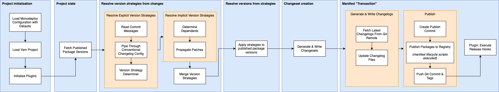

## Architecture

### Code Organization

The Monodeploy codebase is organized as a monorepo, and ultimately uses monodeploy to publish itself.

The `packages/cli` directory contains the root `monodeploy` package, which is a loose wrapper around `@monodeploy/node`. The `@monodeploy/node` package houses the pipeline logic and acts similar to the `@private/core` package of other popular monorepo based projects.

### Publish Pipeline

The high-level of the pipeline aims to be simple, with most complexities abstracted away.

In the first stage of the pipeline, after initialization, we use the loaded conventional changelog config to determine the packages which have been explicitly bumped via commit messages. An explicitly bumped package is always directly included in the commits ranging from the base commit to the publish commit. The conventional changelog configuration is ultimately responsible for correct parsing of the commit messages, and for the correctness of the version strategy determiner algorithm.

The determination of the version strategies by package is the beginning of the creation of Monodeploy's "changeset". This changeset is enhanced a few times throughout the pipeline before ultimately being written out to the changeset file.

Once we have the explicit version strategies, we determine the implicit strategies. This is accomplished by traversing the dependencies graph and finding all dependents of the explicitly bumped packages, excluding dependents which themselves are explicitly bumped. These dependent packages are automatically given a patch version strategy. This is to ensure downstream consumers of the explicitly bumped packages receive updates. If using package groups (similar to Lerna's fixed mode), the greatest strategy is assumed for each group. Note that if no groups are specified, monodeploy defaults to treat each package as its own independent group.

The collection of version strategies associated with the individual packages are now read to apply the version strategy (e.g. "minor") to the latest version of each package. Each package group resolves to use the largest version number among the group for each of its members. Package manifests (`package.json` files) are updated so the `version` of the manifest, and the versions listed in the `dependencies`, `peerDependencies`, and `devDependencies` fields reflect the latest versions we are about to publish.

After manifest files are updated, Yarn triggers an install to update the Yarn lockfile, as well as any other install state files.

Once the manifests of all packages we will be publishing are updated, we trigger a publish to the specified NPM-like registry. Before and after publishing each package, the appropriate npm lifecycle hooks are executed. These hooks are guaranteed to be executed in topological order, if the topological configuration option is enabled.

At this point, the changeset information for each published package is piped through the loaded conventional changelog config, and changelog files are written. Depending on configuration options, the changelog files, and the modified package manifests are committed. If enabled, release git tags are created then created, and the tagged commit is pushed to the remote git repository.

At various steps throughout the pipepline, Monodeploy plugin hooks will be triggered.

### Lifecycle Scripts

At various points in the publish lifecycle, Monodeploy will execute special lifecycle scripts. If leveraging lifecycle scripts, you'll want to familiarize yourself with this section, since Monodeploy may act differently than NPM, Yarn, or Lerna.

There are two types of lifecycle scripts, "pre" scripts and "post" scripts. Monodeploy will execute _all_ "pre" scripts prior to actually publishing any packages, even if using topological sort. This enables you to leverage the pre lifecycle hooks to abort the publish early without leaving the repository in a half-published state.

Once all pre scripts are executed, Monodeploy publishes the package archive to the specified registry. Post scripts will then run, regardless of whether the publish was successful or not.

You can think of the publish process as being split into distinct stages wherein each stage will execute exactly one type of lifecycle script, while respecting topological sort options while executing that stage. For example, when calling "prepublish", Monodeploy will trigger prepublish in topological order (if the topological config option is set) and will _not_ execute the prepack script until _all_ prepublish scripts have completed.

The exact order of lifecycle scripts executed is as follows (this may differ from NPM, Yarn, and Lerna):

1. prepublish
    - This is called before packing even starts. Since NPM will execute this lifecycle script on installs, NPM deprecated this lifecycle script in favour of 'prepublishOnly'. That being said, Yarn Modern _does not_ call prepublishOnly but calls 'prepublish'. Further, Yarn does not call prepublish on install.
2. prepare
    - This is not called by Yarn, however it is called by NPM and by Lerna prior to packing. It is _not recommended_ to leverage this lifecycle hook for compilation.
3. prepublishOnly
    - This is not directly supported by Yarn Modern, however was introduced by NPM as a replacement for the deprecated 'prepublish' script.
4. prepack
    - This is the lifecycle hook that you should be using for any compilation, such as compiling TypeScript to JavaScript. Errors thrown here, or in any early pre lifecycle script, will abort the publish process.
5. ~_publish_~
    - At this "stage" we pack and publish each package. We do not call any 'publish' lifecycle scripts here.
6. postpack
    - This is guaranteed to execute after packing the archive, regardless of failure. This is useful script for build directory cleanup.
7. postpublish
    - This is guaranteed to execute after postpack and is the final lifecycle script called in the publish pipeline. Note that Monodeploy will still do work following this lifecycle script, mainly around changelog generation, and git management.
